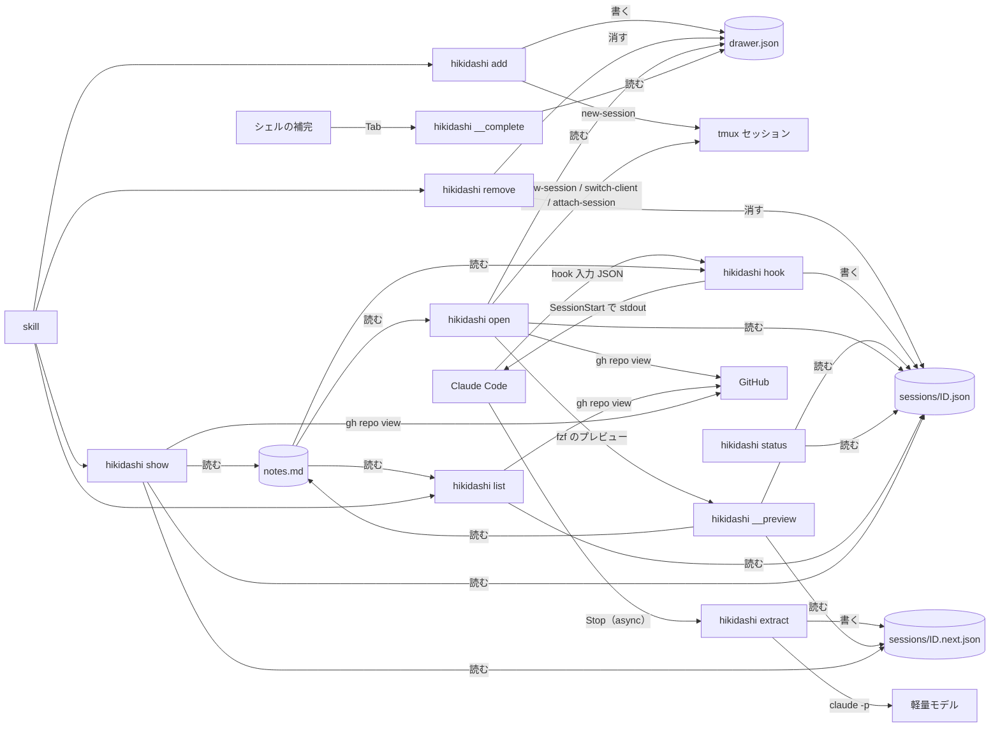
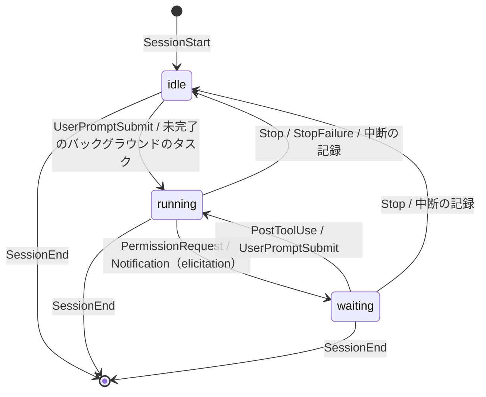

# アーキテクチャ

hikidashi の設計原則と仕組みの構成。何を解くか・語彙は [`../business/concept.md`](../business/concept.md) が持つ。

## 設計原則

### 1. クライアントのリポジトリに痕跡を残さない

- 受託プロジェクトのリポジトリにある `CLAUDE.md` や `.gitignore`、`.git/` には一切手を入れない
- hooks は Claude Code plugin としてユーザースコープで有効にする。プロジェクトの設定には何も書かない
- データはすべてリポジトリ外の `~/.hikidashi/` に置く（下記「データの置き場」）

### 2. 書き手ごとにファイルを分ける

1 ファイルの書き手は 1 種類に限る。書き手が分かれていれば、同時書き込みの競合を設計で排除できる。

| データ | 書き手 | 形式 | 理由 |
| --- | --- | --- | --- |
| 備忘録 | 人間 | Markdown | エディタでそのまま編集でき、エージェントにも読ませやすい |
| セッション状態 | hook | 1 セッション 1 ファイルの JSON | 状態の現在値。`jq` / fzf で扱いやすい |
| 次アクション | 抽出プロセス | 1 セッション 1 ファイルの JSON | hook とは書き込むタイミングが別なので、ファイルを分ける |
| 履歴・集計（将来） | hook | SQLite（`~/.hikidashi/history.db`） | 放置時間や作業履歴の集計が必要になった段階で追加 |

- JSON の書き込みは一時ファイル → rename でアトミックに行う
- SQLite を足した後も、JSON は「現在値のキャッシュ」として残せる

### 3. 状態は決定論、次アクションは抽出

- **状態** は hook のイベントと transcript の記録から決定論で判定する。LLM は使わない（下記「状態モデル」）
- **次アクション**（いま何をしていて、次に何をすべきか）は会話ログから要約して抽出する

### 4. hook は Claude Code を妨げない

- hook は失敗しても exit 0 で終わり、エラーはログにだけ残す。exit 2（ブロック）は使わない
- 状態を記録する hook は同期で動かし、数 ms で終える。時間のかかる処理（抽出）は非同期に逃がす

## 構成要素



| 要素 | 実体 | 役割 |
| --- | --- | --- |
| `hikidashi` | Go の単一バイナリ | 以下のサブコマンドをすべて持つ。`PATH` 上に置く |
| `hikidashi add` | 人間・skill から呼んだ Claude Code が起動 | 作業ディレクトリのプロジェクトを引き出しとして登録し、tmux セッションを用意する |
| `hikidashi remove` | 人間・skill から呼んだ Claude Code が起動 | プロジェクトの登録を取り消す。空でない備忘録は残す |
| `hikidashi hook` | hook から起動 | 登録済みの引き出しへの状態の記録、備忘録の注入 |
| `hikidashi extract` | `Stop` の async hook から起動 | transcript の末尾から次アクションを抽出する |
| `hikidashi open` | 人間が端末・tmux の `display-popup` から起動 | プロジェクトの tmux セッションを（無ければ作って）開く。fzf のプレビューは隠しコマンド `hikidashi __preview` で描く |
| `hikidashi status` | tmux の `status-right` から起動 | 入力待ちの件数を出す |
| `hikidashi list` | 人間・skill から呼んだ Claude Code が起動 | 全プロジェクトの概況を出す |
| `hikidashi show` | 人間・skill から呼んだ Claude Code が起動 | 1 プロジェクト（省略時は作業ディレクトリのプロジェクト）の詳細を出す |
| `hikidashi notes` | 人間が起動 | 現在の引き出しの `notes.md` を `$EDITOR` で開く |
| `hikidashi version` | 人間が起動 | ビルド情報に埋まった版（タグ・疑似バージョン）を出す |
| `hikidashi completion` | 人間がシェルの設定から起動 | zsh・bash の補完スクリプトを出す。候補はスクリプトが隠しコマンド `hikidashi __complete` で得る |
| plugin | `plugin/hooks/hooks.json`・`plugin/skills/hikidashi/SKILL.md` | イベントを繋ぐ・頼まれたコマンドを実行するだけでロジックは持たない |

- 言語は Go とする。hook はツール呼び出しのたびに起動するため起動の速さが効き、単一バイナリで依存なく配れる
- plugin はリポジトリ直下の marketplace（`.claude-plugin/marketplace.json`）から `hikidashi@hikidashi` として配る
- plugin にはバイナリを同梱しない。プラットフォームごとのバイナリを plugin に積むと配布が重くなるため、`PATH` 上の `hikidashi` を呼ぶ
- `hikidashi` は GitHub Releases に OS・arch 別の単一バイナリ（linux・darwin × amd64・arm64）として配る
- 外部コマンドへの依存は `git`・`tmux`・`fzf`・`claude`・`gh` に限る。`gh` は `list`・`show`・`open` が Open な Issue を数えるのにだけ使う
- 対象 OS は Linux と macOS。生存確認は Linux は `/proc/<pid>/comm`、macOS は sysctl `kern.proc.pid` のプロセス名で行う

## 状態モデル

| 状態 | 識別子 | 意味 |
| --- | --- | --- |
| 走行中 | `running` | Claude がターンを処理している |
| 入力待ち | `waiting` | ターンの途中で人間の判断（権限の承認・入力フォーム）を待っている |
| アイドル | `idle` | ターンが終わり、人間の次の指示を待っている |

終了したセッションは状態を持たず、ファイルごと消える（下記「セッションの後始末」）。



| イベント | matcher | 状態 | その他の処理 |
| --- | --- | --- | --- |
| `SessionStart` | `startup` `resume` `clear` `fork` | `idle` | 備忘録を注入する |
| `SessionStart` | `compact` | 変えない | 備忘録を注入する（圧縮で失われるため） |
| `UserPromptSubmit` | — | `running` | |
| `PermissionRequest` | — | `waiting` | |
| `Notification` | `elicitation_dialog` `elicitation_url_dialog` | `waiting` | |
| `PostToolUse` | — | `running` | 権限の承認後に走行へ戻ったことを拾う |
| `Stop` / `StopFailure` | — | `idle` | `Stop` では async で `hikidashi extract` を起動する |
| `SessionEnd` | — | — | セッションのファイルを消す |

- `PermissionRequest` で `waiting` にする理由: 権限プロンプトの直前に発火する。`Notification` の `permission_prompt` は表示から約 6 秒遅れて届くため使わない
- `PostToolUse` が必要な理由: 権限を承認しても `UserPromptSubmit` は発火しない。承認後に最初に発火するのはツール実行後の `PostToolUse` である
- 状態が変わらないイベントではファイルを書かない。`PostToolUse` は頻繁に発火するため、読むだけで終える
- `PostToolUse` は `waiting` のときだけ `running` にする（状態図どおり）。ファイルが無い・`idle` のセッションは走行中にしない
- `SessionStart`（`compact` 以外）は、ファイルがあっても `idle` で書き直し、`started_at` を今にする
- 他のイベントでファイルが無ければ（hikidashi の導入前から続くセッション等）、`started_at` を今にして作る
- 表の matcher の絞り込みは hikidashi が入力の `hook_event_name`・`source`・`notification_type` で行い、plugin の matcher に頼らない。何もしない入力（表に無い通知種別・未知のイベント）は git を起動する前に終える
- `session_id` はファイル名に使うため `[A-Za-z0-9_-]+` に限る。それ以外はパス横断を防ぐため入力の誤りとし、ログに残して終える

### 中断の扱い

ユーザーが Esc で中断すると、`Stop` も `Notification`（`idle_prompt` を含む）も発火せず、状態を変える hook が無い。
一方 transcript には、中断の記録として `[Request interrupted by user]`（ツール実行中は `[Request interrupted by user for tool use]`）で始まる `user` のエントリが残る。

- 読み手（`status` / `list` / `show`）は、`running` / `waiting` のセッションについて transcript の末尾を読み、最後の `user` のエントリが中断の記録で、その時刻が `state_changed_at` より後なら `idle` として扱う
- セッションのファイルは書き換えない（書き手は hook だけ）。次の `UserPromptSubmit` で hook が正しい状態に戻す

### バックグラウンドのタスクの扱い

バックグラウンドのエージェントを残してメインのターンが終わると `Stop` で `idle` になり、完了通知でターンが再開するまで、人間を待っていないのに `idle` と見える。
transcript には起動と完了通知が残るため、読み手がこれを突き合わせる。

- 読み手は、中断の扱いの後で実効の状態が `idle` のセッションについて transcript の全体を先頭から読み、未完了のエージェントが残っていれば `running` として扱う。放置の起点は `idle` に入った時刻のまま
- 起動は `isSidechain` が偽の `user` のエントリの `toolUseResult` で、`status` が `async_launched` の `agentId` と、SendMessage による再開の `resumedAgentId` とする。時刻が `started_at` より後のものだけ数える（resume 前のタスクで走行中が残り続けないため）
- 完了は `<task-notification>` で始まり `<status>` を持つ通知で、`<status>` より前の `<task-id>` のタスクとする。`user` の文字列の content と、ターン中に吸収された `attachment`（`type` が `queued_command`）の `prompt` から拾う。`<status>` の無い Monitor のイベント通知は完了としない
- 起動と完了は記録の順に出し入れする。再開したエージェントは同じ ID で何度も通知するため。自身のバックグラウンドの子を残して止まったエージェントも通知し（子の完了で動き直すと再び通知する）、その間は `idle` と出る
- メインが起動していない ID の通知（サブエージェントが起動した孫エージェントの通知。`user` や `queue-operation` として届く）は数えない
- `async_launched`・`resumedAgentId`・`<task-id>` のどれも含まない行は JSON を解かずに飛ばす。手元最大の 41MB の transcript でも全体を読んで 100ms 未満に収まり、`running` / `waiting` のセッションは読まない
- Bash の `run_in_background`（`backgroundTaskId`）は数えない。Issue #49 の要求は Bash も含めていたが、開発サーバのような終わらないプロセスでは完了通知が来ず、人間を待っているセッションが `running` のまま隠れる。`idle` の意味（人間の次の指示を待っている）を優先し、有限で終わる Bash の実行中は従来どおり `idle` と出す
- セッションのファイルは書き換えない（書き手は hook だけ）。完了通知でターンが再開すれば hook が `running` を記録する

## データの置き場

```
~/.hikidashi/
├── hikidashi.log                      # hook・extract のエラーログ
└── drawers/<slug>/
    ├── drawer.json                    # 引き出しのメタ情報
    ├── notes.md                       # 備忘録（人間が書く）
    └── sessions/
        ├── <session_id>.json          # セッション状態（hook が書く）
        ├── <session_id>.next.json     # 次アクション（extract が書く）
        └── <session_id>.extract.lock  # 抽出の排他・間引き用
```

- ディレクトリは 0700、ファイルは 0600 で作る。プロジェクトの情報を他のユーザーから読めなくするため
- リポジトリ内（`<repo>/.hikidashi/` を `.git/info/exclude` で除外）は採らない。`.git` もプロジェクトのリポジトリの一部であり、原則 1 に反するため
- 備忘録がリポジトリの横に無い分は、`hikidashi notes` で補う
- リポジトリを移動すると別の引き出しになる。頻度が低いため、移行の仕組みは持たない

### スキーマ

`drawer.json`

| フィールド | 内容 |
| --- | --- |
| `path` | リポジトリのルートの絶対パス（シンボリックリンク解決済み） |
| `name` | リポジトリ名（`path` の basename）。一覧での表示名 |
| `created_at` | 登録時刻（RFC 3339） |

`sessions/<session_id>.json`

| フィールド | 内容 |
| --- | --- |
| `session_id` | Claude Code のセッション ID |
| `cwd` | 直近の hook 入力の作業ディレクトリ |
| `tmux_pane` | `$TMUX_PANE`（例: `%12`） |
| `claude_pid` | `$CLAUDE_PID`（Claude Code 本体の PID）。生存確認に使う |
| `transcript_path` | 会話ログの JSONL のパス |
| `state` | `running` / `waiting` / `idle` |
| `state_changed_at` | 現在の状態に入った時刻。放置時間の表示に使う |
| `started_at` | セッションの開始時刻 |

`sessions/<session_id>.next.json`

| フィールド | 内容 |
| --- | --- |
| `summary` | いま何をしているか（1〜2 文） |
| `human_next` | 人間の次アクション。無ければ空 |
| `claude_next` | Claude の次アクション。無ければ空 |
| `blockers` | ブロッカーの配列（要素は文字列） |
| `generated_at` | 抽出した時刻 |

## 引き出しの解決と登録

hook・extract・`hikidashi notes`・`hikidashi add`・引数なしの `hikidashi remove`・`hikidashi open`・`hikidashi show` は `cwd`（hook の入力、または作業ディレクトリ）から引き出しを決める。

1. `git -C <cwd> rev-parse --path-format=absolute --git-common-dir --show-toplevel` を 1 回呼ぶ。共通の `.git` の basename が `.git` ならその親を、それ以外（submodule 等）は toplevel をリポジトリのルートとし、シンボリックリンクを解決する。worktree からでもメイン worktree に寄り、submodule はそれ自身の引き出しになる
2. git が非 0 で終わる `cwd`（Git 管理外・bare・`.git` の中・存在しない）は追跡しない（1 プロジェクト = 1 リポジトリ）。備忘録の注入も行わない。git を起動できないときだけエラーにする
3. `<slug>` は `<name>-<ルートの絶対パスの SHA-256 の先頭 8 桁>` とする（例: `api-3f2a9c1b`）
4. `drawers/<slug>/drawer.json` があれば登録済みとし（`hikidashi add` が書き、`hikidashi remove` が消す）、それだけを記録・注入・抽出・`hikidashi notes` の対象にする。無ければ（未登録）何も作らず何もしない。壊れていればエラーにする

- slug をハッシュにする理由: パスを `-` で繋ぐ方式は `a-b/c` と `a/b-c` が衝突し、衝突の検出と回避を別途書くことになる。ハッシュなら固定長で衝突を考えなくてよく、読みやすさは `name` の接頭辞で保つ
- 未登録はエラーではない。hook・extract は `hikidashi.log` にも何も書かずに exit 0 で終える。人が登録していないリポジトリで Claude Code が動くのは普通のことであり、そのたびに記録やログを残さないため
- 引き出しの一覧は `drawers/` 配下の列挙で得る。別途の一覧ファイルは持たない
- submodule を親の引き出しに寄せない理由: 独立したリポジトリであり、語彙どおり別のプロジェクトとして扱う。submodule の worktree も別の引き出しになる
- `$TMUX_PANE` が空（tmux 外）のセッションは状態を記録しない。備忘録の注入は行う
- tmux 外を記録しない理由: Claude Code はプロジェクトの tmux セッションで動かすもの（1 プロジェクト = 1 tmux セッション）であり、その外のセッションは追う対象にしない（#41）

### `hikidashi add`

1. 作業ディレクトリの引き出しを上記の規則で解決し、未登録なら `drawer.json` を書いて登録する。Git 管理外なら何も作らない
2. 引き出しの tmux セッションが無ければ（`tmux has-session -t =<name>` の exit 1）、`tmux new-session -d -s <name> -c <リポジトリのルート>` で作る。サーバーが未起動でも exit 1 になり、`new-session` がサーバーを起動する
3. 引き出しとセッションの結果を 1 行ずつ stdout に出す: `drawer: <slug> (registered|already registered)`、`tmux session: <name> (created|already exists)`

- 足りない方だけを作るため、何度実行してもよい。既存の `drawer.json`（`created_at`）とセッションには触れない
- 引数があれば exit 2。Git 管理外・git や tmux の失敗は、理由を stderr に出して exit 1 とする
- tmux のセッション名は slug の `.` と `:` を `_` に置き換えたもの（例: `example_com-3f2a9c1b`）。tmux がこの 2 文字をターゲットの区切りに使うため
- セッション名を slug から作る理由: 引き出しと 1 対 1 で決まり、同名で別パスのリポジトリでも衝突しない。対応を保存する欄も要らない
- `has-session` のターゲットに `=` を付けるのは、tmux が付けないと前方一致で別のセッションにも一致させるため

### `hikidashi remove`

1. 対象の引き出しを決める。引数が無ければ作業ディレクトリから上記の規則で、1 個あれば登録済みの引き出しから名前で引く
2. `drawer.json` を先に消して登録を外す（以後 hook・extract・`open`・`status`・`list`・`show` の対象外になる）。次に `notes.md` 以外（`sessions/`）を消す。`notes.md` が無い・空白だけなら引き出しのディレクトリごと消す
3. `drawer: <slug> (removed)` を stdout に出し、備忘録を残したときだけ `notes: <notes.md の絶対パス> (kept)` を続ける

- 名前は slug の完全一致を優先し、無ければ `name` が一意に一致する引き出しとする。`name` が複数に一致すれば候補の slug を出してエラーにする。この解決は `hikidashi open`・`hikidashi show` と共有する
- 空でない備忘録を残すのは、確認なしに人の書いたものを失わないため。`drawer.json` が無いので記録・一覧・注入の対象にならず、同じパスの `hikidashi add` で slug が同じ引き出しに戻る
- tmux セッションには触れない。pane で動く Claude Code やエディタの作業を巻き込むため。閉じるのは人が行う
- 引数が 2 個以上なら exit 2。Git 管理外・未登録・曖昧な名前・I/O の失敗は、理由を stderr に出して exit 1 とする。未登録なら `hikidashi add` で登録できることも出す。見つからないときはデータルートにも tmux にも触れない

## 備忘録

### 注入

- `SessionStart` のすべての `source` で、`notes.md` を JSON の `hookSpecificOutput.additionalContext` に入れて stdout に 1 回で出す。tmux 外のセッションにも出す
- `additionalContext` は見出し `# hikidashi notes for <name> (<notes.md の絶対パス>)`、空行、`notes.md` の本文の順に並べる
- 素の Markdown で出さない理由: 本文が `{`〜`}` だと JSON と解釈され、注入の成否が内容次第になる
- `notes.md` が無い・空白だけなら何も出さない。注入と状態の記録は独立させ、片方が失敗してももう片方を行う
- Claude Code は 10,000 字を超える `additionalContext` をファイルに退避し、そのパスと先頭 2,000 字のプレビュー（見出しを含む）だけを渡す。Claude は退避先を読むよう促されないため、常に見せたいことは先頭に書く。hikidashi は切り詰めない

### `hikidashi notes`

- 作業ディレクトリの登録済みの引き出しに、`notes.md` が無ければ空（0600）で作ってから `$EDITOR` で開く。既存の中身は変えない
- `$EDITOR` は空白で分割し、シェルを介さずに起動する。引用符付きの値には対応しない
- 引数があれば exit 2。Git 管理外・未登録・`$EDITOR` が空・エディタの失敗は exit 1 とする。Git 管理外・未登録では「登録済みの引き出しの中にいない」ことと、`hikidashi add` で登録できることを stderr に出す。Git 管理外・未登録・`$EDITOR` が空ではデータルートに何も作らない

## 次アクションの抽出

1. `Stop` の async hook が `hikidashi extract` を起動する（hook の完了は待たれない）。`HIKIDASHI_DISABLE=1`・`$TMUX_PANE` が空・Git 管理外・未登録なら、stdin を読んだ後に何もせず終える
2. `<session_id>.extract.lock` の中身を「再実行要求」の印とし、印を立ててから flock（待たない）を試みる。取れなければそのまま終わる。保持者は「印を消して抽出」を印が無くなるまで繰り返し、解放後に印が残っていれば取り直す（解放の直前に届いた要求を取りこぼさない）。連続したイベントは後ろ寄せで 1 回にまとまり、同じセッションの抽出は並行しない
3. transcript の JSONL から末尾の `user` / `assistant` のテキストをバイト上限まで集める。ツールの入出力は落とす
4. `claude -p --model haiku --output-format json --json-schema <スキーマ> --no-session-persistence --tools "" --system-prompt <プロンプト>` に会話を stdin で渡す。作業ディレクトリはデータルート、環境変数に `HIKIDASHI_DISABLE=1` を足し、120 秒で打ち切る
5. 結果の `is_error` が偽・`subtype` が `success`・`structured_output` に 4 フィールドが揃っていれば、セッション状態のファイルがあることを確かめてから `<session_id>.next.json` をアトミックに書く。失敗したら前回の結果に触れない

- extract も hook と同じく常に exit 0 で終え、失敗は `hikidashi.log` に `extract:` の行で残す
- 再帰の防止: 子の `claude -p` でもユーザーの plugin の hooks は発火し、`$TMUX_PANE` も引き継がれる。放置すると抽出のたびに偽のセッションが記録されるため、子には `HIKIDASHI_DISABLE=1` を渡し、`hikidashi hook` と `hikidashi extract` はこれを見たら何もせずに終える。hooks を飛ばす `--bare` は OAuth 認証で使えないため採らない
- 子をデータルートで動かすのは、プロジェクトのリポジトリの `CLAUDE.md` や設定を読ませないため。`--tools ""` により子はツールを使えず、transcript に書かれた指示に従ってもファイルやコマンドに触れない
- `--no-session-persistence` により、抽出の実行は transcript を残さない。構造化出力は結果の JSON の `structured_output` に入る
- セッション状態のファイルを確かめるのは、抽出の間に `SessionEnd` が来たセッションに、読み手のいない次アクションを残さないため
- 要約用のプロンプトとスキーマはバイナリに埋め込む

## セッションの後始末

- `SessionEnd` で `<session_id>.*` を消す。`--resume` で戻れば `SessionStart` で作り直される
- `SessionEnd` は `/exit` や pane の kill（SIGHUP）では発火するが、SIGKILL やクラッシュでは発火しない
- 取り残されたファイルは、読み手（`status` / `list` / `show`）が `claude_pid` のプロセスが生きていてプロセス名が `claude` であることを確かめ、そうでなければ消す
- pane の存在では生死を判定しない。claude が死んでも pane はシェルに戻って残るため
- 読み手が消すのは原則 2 の例外だが、消すのは書き手が二度と書かないファイルに限るため競合しない

## UI

- 状態と放置時間は中断とバックグラウンドのタスクを反映した実効の値で出す（上記「中断の扱い」「バックグラウンドのタスクの扱い」）。放置時間はその状態に入ってからの経過で、`5m` / `3h` / `2d` の形に切り捨てる
- `hikidashi status` は `waiting` の件数だけを出す。0 件なら何も出さない。出力は件数と改行のみで、引数があれば exit 2、失敗は `!` を出して exit 1 とする
- `hikidashi list` は罫線付きの表、`hikidashi show` は角丸の枠で出し、状態を色で示す（下記「`hikidashi list`」「`hikidashi show`」）。表と枠は lipgloss で組む
- 色は常に付け、書き出すときに colorprofile が落とす。stdout が端末でない（パイプ・skill から呼んだ Claude Code）か `NO_COLOR` があれば色の制御文字を出さず、罫線だけのテキストになる。`CLICOLOR_FORCE` があれば端末でなくても色を残す
- tmux への組み込み（キーバインドと `status-right`）はユーザーが `tmux.conf` に書く。hikidashi は `tmux.conf` を書き換えない

### `hikidashi open`

1. 開く引き出しを決める。引数が 1 個なら `hikidashi remove` と同じ規則で名前から引き、無ければ作業ディレクトリから上記「引き出しの解決と登録」の規則で引く。作業ディレクトリが Git 管理外なら、全引き出しを fzf に並べて選ばせる
2. 引き出しの tmux セッションが無ければ、`hikidashi add` と同じ規則（`has-session` → `new-session`）で作る
3. `$TMUX` が空でなければ `tmux switch-client -t =<name>` で今のクライアントを切り替え、空なら `tmux attach-session -t =<name>` で繋ぐ

- fzf の一覧の表は `hikidashi list` と列・色・名前の順を共有し、外枠を出さず見出しの横線と列の縦線だけを持つ（fzf は下端の罫線を固定できないため）。見出しと区切り線の 2 行は選べない行として一覧の上に固定する。各行の先頭に fzf には見せない slug と Issue の件数（`ISSUES` 列と同じ値）を持たせ、プレビューは隠しコマンド `hikidashi __preview {1} {2}` でそれを受け取る
- 絞り込みは表の名前のセルにだけ当て（`--nth`）、件数や NOTES の文字では当たらない。Issue の件数が得られない理由は fzf の画面に上書きされるため出さず、表の `?` だけで示す
- プレビューは `hikidashi show` と同じ詳細を同じ幅と色の規則で出すが、Issue の件数は一覧で数えた値（`?` を含む）を使い `gh` を呼ばない。カーソルを動かすたびに数え直す待ち時間を省くため。件数が `?` でも理由は出さない
- `__preview` は使い方にも補完にも出さない。引数が 2 個でない・件数が非負の整数でも `?` でもなければ exit 2、存在しない引き出しは exit 1 とする
- プレビューは端末の幅によらず常に一覧の下に全幅で置く。表の NOTES は一覧の幅（fzf のカーソルとスクロールバーの 3 桁を除く）に収まるよう切り詰める
- 一覧とプレビューの出力は fzf へのパイプで端末でないため、`CLICOLOR_FORCE=1` で一覧の表に色を付け、fzf にも渡してプレビューに色と枠を出させる。`NO_COLOR` があればどちらも色を付けない。JSON を読む `gh` には `CLICOLOR_FORCE=0` で色を付けさせない
- Esc 等で何も選ばずに閉じたら何もせず exit 0 とする。登録済みの引き出しが無ければ fzf を出さずに `hikidashi add` を案内して exit 1 とする
- Git 管理下で未登録なら、何も開かずに `hikidashi add` を案内して exit 1 とする
- Git 管理外で一覧に落とすのは、tmux の `display-popup -d /` から全プロジェクトを選べるようにするため。プロジェクトのセッションはリポジトリのルートで作られ、その中からは一覧を出す手段が他に無い
- ターゲットに `=` を付けるのは、`has-session` と同じく前方一致で別のセッションへ移らないため
- 入力待ちのセッションの pane へ直接は移らない。プロジェクトのセッションを開き、その中の window / pane は tmux の操作で選ぶ
- 引数が 2 個以上なら exit 2。未登録・曖昧な名前・fzf や tmux の失敗は、理由を stderr に出して exit 1 とする。見つからないときは tmux に触れない

### `hikidashi list`

- 登録済みの全引き出しを名前の順（同名は slug の順）に、見出し `DRAWER`・`ISSUES`・`RUNNING`・`WAITING`・`IDLE`・`NOTES` を持つ角丸の罫線の表で 1 引き出し 1 行に出す。件数の列は右に寄せる
- slug の列は持たない。同名の引き出しは別々の行に出し、見分けは `hikidashi show <name>` が出す候補の slug で行う
- 件数は 1 件以上を状態ごとの色（Issue は紫、`running` は緑、`waiting` は橙、`idle` は灰）の太字で示し、0 件と `?` は目立たない色にする
- 件数の数え方と `?` の扱いは下記「`hikidashi show`」と同じ。Issue は引き出しごとに並行して数える
- `NOTES` は左寄せで、`notes.md` の最初の空白でない行を前後の空白を削って出す。Markdown の記号（`#`・`- ` 等）は加工しない。`notes.md` が無い・空白だけなら空欄にする。全文は `hikidashi show` で見る
- `NOTES` は表が出力先の幅（`hikidashi show` と同じ規則）に収まるよう表示幅で `…` に切り詰め、見出しの幅より狭くはしない。幅が得られない（パイプ等）なら切り詰めない
- 登録済みの引き出しが無ければ `no drawers registered (run hikidashi add in a repository)` を出して exit 0、引数があれば exit 2 とする

### `hikidashi show`

- `hikidashi show <drawer>` は 1 つの引き出しの詳細を、引き出し・セッションごと・`notes.md` の角丸の枠に分けて出す。枠の上辺にタイトルを置き、幅は出力先の幅（fzf のプレビューの `FZF_PREVIEW_COLUMNS`、無ければ端末の幅）いっぱいにして、収まらない値は値の列の中で折り返す（タイトルは切り詰める）。幅が得られない（パイプ等）・値の列が 1 桁も取れないときは、最長の行に合わせて折り返さない
- 幅が 119 桁以上でセッションが 1 つ以上あれば、左にセッションの枠、右に引き出しの枠と `notes.md` の枠を上揃えで並べる。列の間は 1 桁で、割り切れない 1 桁は左の列に寄せる。119 桁は値の列が 41 桁（全角 20 字）以上取れる最小の幅で、これより狭いと次アクションが細かく折り返されて並べた意味が薄れる。それ未満・幅が得られない・セッションが無いときは上から縦に積む
- 引き出しの枠（青）はタイトルが name で、`path`・`slug`・`issues`（`<N> open`、得られなければ `?`）の行を持つ
- セッションの枠はタイトルが `session <session_id>` と状態の札（` WAITING 10m ` の形で放置時間を添える）で、枠と札の色が実効の状態を示す。`pane` と次アクションの全項目（`next.json` のフィールド名をラベルにする）の行を持つ
- セッションは `waiting` → `idle` → `running`（人間が捌くべきものを上に）、同順位は放置の長い順に並べ、無ければ `(no sessions)` を出す。最後に `notes.md` の枠（暗い灰）に備忘録の本文を出す
- 状態の件数・状態・放置時間は中断とバックグラウンドのタスクを反映した実効の値で、claude が終わったセッションは後始末して数えない
- `<drawer>` は `hikidashi remove` と同じ規則で引き出しを決める（上記「`hikidashi remove`」）。名前が複数に当たれば候補の slug を stderr に出して exit 1 とする
- 引数が無ければ作業ディレクトリの引き出しの詳細を、その slug を渡したときと同じに出す。Git 管理外なら `hikidashi list` を、未登録なら `hikidashi add` を stderr で案内して exit 1 とする
- Open な Issue の件数は、リポジトリのルートで `gh repo view --json issues` を実行した `issues.totalCount`（Pull Request を含まない）とする。1 回 10 秒で打ち切る。キャッシュは持たず、実行のたびに数える（`hikidashi open` のプレビューだけは一覧で数えた値を使う。上記「`hikidashi open`」）
- 数えるリポジトリは `gh` の選択に従う（`gh repo set-default`、無ければリモート名 `upstream` → `github` → `origin` の順）。fork で `upstream` を持つと元のリポジトリの件数になるため、`gh repo set-default` で選び直す
- 件数が得られない（GitHub のリモートが無い・`gh` が無い・認証切れ・打ち切り）ときは `?` とし、0 件と区別する。理由を stderr に出したうえで exit 0 とする
- 存在しない引き出しは理由を stderr に出して exit 1、引数が 2 個以上なら exit 2 とする

### `hikidashi completion`

- `hikidashi completion <zsh|bash>` は補完スクリプトを stdout に出す。zsh は compinit の後に `source <(hikidashi completion zsh)`、bash は `source <(hikidashi completion bash)` で有効にする
- スクリプトは Tab のたびに `hikidashi __complete <hikidashi より後ろの語...>` を呼び、最後の語を接頭辞とする候補を `値 TAB 説明` の行で受け取る。候補の決め方は Go 側に集め、スクリプトは受け渡しだけをする
- 候補は 1 語目ならサブコマンド（説明は概要）、2 語目なら `open`・`show`・`remove` は登録済みの引き出し、`completion` は `zsh`・`bash` とし、それ以外は出さない
- 引き出しの候補は毎回 `drawer.json` を読むため、`add`・`remove` の直後から反映される。名前の順（同名は slug の順）に並べ、説明はパス（ホーム配下は `~` 始まり）とする
- 引き出しの値は、`name` が一意でどの slug とも一致しなければ `name`、それ以外は slug とする。上記「`hikidashi remove`」の規則で必ずその引き出しに当たり、曖昧エラーにならない
- zsh は `_describe`、bash は bash-completion に頼らず `complete -F` で渡す。どちらも `hikidashi __complete` の stderr は捨てる
- `completion` の引数が 1 個でない・対応していないシェルなら exit 2。`__complete` は使い方に出さず、候補を得られなければ stdout に何も出さず exit 1 とする

## 未決事項

- **SQLite を導入するタイミング**
