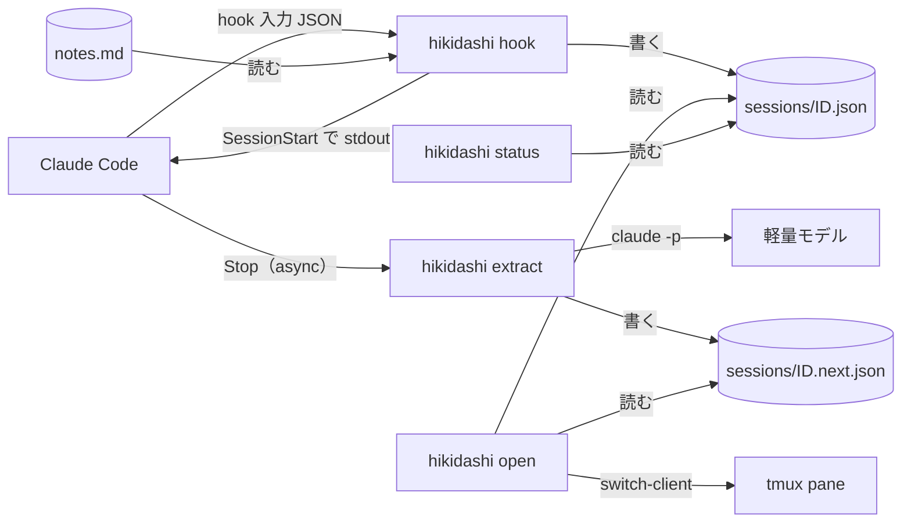
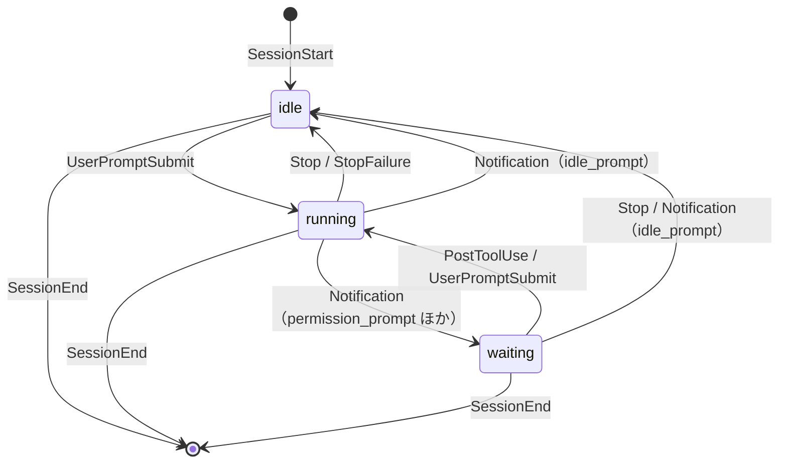

# アーキテクチャ

hikidashi の設計原則と仕組みの構成。何を解くか・語彙は [`../business/concept.md`](../business/concept.md) が持つ。

## 設計原則

### 1. クライアントのリポジトリに痕跡を残さない

- 受託案件のリポジトリにある `CLAUDE.md` や `.gitignore`、`.git/` には一切手を入れない
- hooks は Claude Code plugin としてユーザースコープで有効にする。プロジェクトの設定には何も書かない
- データはすべてリポジトリ外の `~/.hikidashi/` に置く（下記「データの置き場」）

### 2. 書き手ごとにファイルを分ける

1 ファイルの書き手は 1 種類に限る。書き手が分かれていれば、同時書き込みの競合を設計で排除できる。

| データ | 書き手 | 形式 | 理由 |
| --- | --- | --- | --- |
| 備忘録 | 人間 | Markdown | エディタでそのまま編集でき、エージェントにも読ませやすい |
| セッション状態 | hook | 1 セッション 1 ファイルの JSON | 状態の現在値。`jq` / fzf で扱いやすい |
| 次アクション | 抽出プロセス | 1 セッション 1 ファイルの JSON | hook とは書き込むタイミングが別なので、ファイルを分ける |
| 履歴・集計（将来） | hook | SQLite（`~/.hikidashi/history.db`） | 放置時間や作業履歴の集計が必要になった段階で追加 |

- JSON の書き込みは一時ファイル → rename でアトミックに行う
- SQLite を足した後も、JSON は「現在値のキャッシュ」として残せる

### 3. 状態は決定論、次アクションは抽出

- **状態** は hook のイベントから確実に判定する。LLM は使わない（下記「状態モデル」）
- **次アクション**（いま何をしていて、次に何をすべきか）は会話ログから要約して抽出する

### 4. hook は Claude Code を妨げない

- hook は失敗しても exit 0 で終わり、エラーはログにだけ残す。exit 2（ブロック）は使わない
- 状態を記録する hook は同期で動かし、数 ms で終える。時間のかかる処理（抽出）は非同期に逃がす

## 構成要素



| 要素 | 実体 | 役割 |
| --- | --- | --- |
| `hikidashi` | Go の単一バイナリ | 以下のサブコマンドをすべて持つ。`PATH` 上に置く |
| `hikidashi hook` | hook から起動 | 引き出しの登録、状態の記録、備忘録の注入 |
| `hikidashi extract` | `Stop` の async hook から起動 | transcript の末尾から次アクションを抽出する |
| `hikidashi open` | tmux の `display-popup` から起動 | fzf で一覧を出し、選んだ pane へ移動する |
| `hikidashi status` | tmux の `status-right` から起動 | 入力待ちの件数を出す |
| `hikidashi notes` | 人間が起動 | 現在の引き出しの `notes.md` を `$EDITOR` で開く |
| plugin | `hooks/hooks.json` | 各イベントを `hikidashi` に繋ぐだけ。ロジックは持たない |

- 言語は Go とする。hook はツール呼び出しのたびに起動するため起動の速さが効き、単一バイナリで依存なく配れる
- plugin にはバイナリを同梱しない。プラットフォームごとのバイナリを plugin に積むと配布が重くなるため、`PATH` 上の `hikidashi` を呼ぶ
- 外部コマンドへの依存は `git`・`tmux`・`fzf`・`claude` に限る

## 状態モデル

| 状態 | 識別子 | 意味 |
| --- | --- | --- |
| 走行中 | `running` | Claude がターンを処理している |
| 入力待ち | `waiting` | ターンの途中で人間の判断（権限の承認・入力フォーム）を待っている |
| アイドル | `idle` | ターンが終わり、人間の次の指示を待っている |

終了したセッションは状態を持たず、ファイルごと消える（下記「セッションの後始末」）。



| イベント | matcher | 状態 | その他の処理 |
| --- | --- | --- | --- |
| `SessionStart` | `startup` `resume` `clear` `fork` | `idle` | 引き出しを登録し、備忘録を stdout に出す |
| `SessionStart` | `compact` | 変えない | 備忘録を stdout に出す（圧縮で失われるため） |
| `UserPromptSubmit` | — | `running` | |
| `PostToolUse` | — | `running` | 権限の承認後に走行へ戻ったことを拾う |
| `Notification` | `permission_prompt` `elicitation_dialog` `elicitation_url_dialog` | `waiting` | |
| `Notification` | `idle_prompt` | `idle` | |
| `Stop` / `StopFailure` | — | `idle` | `Stop` では async で `hikidashi extract` を起動する |
| `SessionEnd` | — | — | セッションのファイルを消す |

- `PostToolUse` が必要な理由: 権限を承認しても `UserPromptSubmit` は発火しない。承認後に最初に発火するのはツール実行後の `PostToolUse` である
- `idle_prompt` を `idle` に写す理由: ユーザーが中断すると `Stop` は発火せず、`running` が残る。応答後に約 60 秒入力が無いと届く `idle_prompt` で自己修復する
- `Notification` は matcher ごとに hooks.json のエントリを分け、遷移先を引数で渡す。stdin に種別が載るかに依存しない
- 状態が変わらないイベントではファイルを書かない。`PostToolUse` は頻繁に発火するため、読むだけで終える
- `waiting` の記録は、権限プロンプトの表示から約 6 秒遅れる（`permission_prompt` の発火が遅いため）

## データの置き場

```
~/.hikidashi/
├── hikidashi.log                      # hook・extract のエラーログ
└── drawers/<slug>/
    ├── drawer.json                    # 引き出しのメタ情報
    ├── notes.md                       # 備忘録（人間が書く）
    └── sessions/
        ├── <session_id>.json          # セッション状態（hook が書く）
        ├── <session_id>.next.json     # 次アクション（extract が書く）
        └── <session_id>.extract.lock  # 抽出の排他・間引き用
```

- リポジトリ内（`<repo>/.hikidashi/` を `.git/info/exclude` で除外）は採らない。`.git` も案件リポジトリの一部であり、原則 1 に反するため
- 備忘録がリポジトリの横に無い分は、`hikidashi notes` で補う
- リポジトリを移動すると別の引き出しになる。頻度が低いため、移行の仕組みは持たない

### スキーマ

`drawer.json`

| フィールド | 内容 |
| --- | --- |
| `path` | リポジトリのルートの絶対パス（シンボリックリンク解決済み） |
| `name` | リポジトリ名（`path` の basename）。一覧での表示名 |
| `created_at` | 登録時刻（RFC 3339） |

`sessions/<session_id>.json`

| フィールド | 内容 |
| --- | --- |
| `session_id` | Claude Code のセッション ID |
| `cwd` | 直近の hook 入力の作業ディレクトリ |
| `tmux_pane` | `$TMUX_PANE`（例: `%12`） |
| `transcript_path` | 会話ログの JSONL のパス |
| `state` | `running` / `waiting` / `idle` |
| `state_changed_at` | 現在の状態に入った時刻。放置時間の表示に使う |
| `started_at` | セッションの開始時刻 |

`sessions/<session_id>.next.json`

| フィールド | 内容 |
| --- | --- |
| `summary` | いま何をしているか（1〜2 文） |
| `human_next` | 人間の次アクション。無ければ空 |
| `claude_next` | Claude の次アクション。無ければ空 |
| `blockers` | ブロッカーの配列 |
| `generated_at` | 抽出した時刻 |

## 引き出しの解決と登録

hook は入力の `cwd` から引き出しを決める。

1. `git -C <cwd> rev-parse --path-format=absolute --git-common-dir` で共通の `.git` を得て、その親をリポジトリのルートとする。worktree からでもメイン worktree に寄る
2. Git 管理外の `cwd` は追跡しない（1 案件 = 1 リポジトリ）。備忘録の注入も行わない
3. `<slug>` は `<name>-<ルートの絶対パスの SHA-256 の先頭 8 桁>` とする（例: `api-3f2a9c1b`）
4. `drawers/<slug>/` が無ければ作り、`drawer.json` を書く。これが登録であり、別途の一覧ファイルは持たない

- slug をハッシュにする理由: パスを `-` で繋ぐ方式は `a-b/c` と `a/b-c` が衝突し、衝突の検出と回避を別途書くことになる。ハッシュなら固定長で衝突を考えなくてよく、読みやすさは `name` の接頭辞で保つ
- 引き出しの一覧は `drawers/` 配下の列挙で得る。ディレクトリの作成は冪等なので、同時に発火しても競合・重複しない
- `$TMUX_PANE` が空（tmux 外）のセッションは状態を記録しない。移動先が無く、生存確認もできないため。登録と備忘録の注入は行う

## 次アクションの抽出

1. `Stop` の async hook が `hikidashi extract` を起動する（hook の完了は待たれない）
2. `extract.lock` を flock で取る。取れなければ「再実行要求」の印を残して終わる。保持者は抽出後に印を見て、あればもう一度だけ回す（連続したイベントを後ろ寄せで 1 回にまとめる）
3. transcript の JSONL から末尾の `user` / `assistant` のテキストをバイト上限まで集める。ツールの入出力は落とす
4. `claude -p --model haiku --output-format json --json-schema <スキーマ> --no-session-persistence` に渡す
5. 成功したら `<session_id>.next.json` をアトミックに書く。失敗したら前回の結果を残し、ログに書く

- 再帰の防止: 子の `claude -p` には環境変数 `HIKIDASHI_DISABLE=1` を渡し、`hikidashi hook` はこれを見たら何もせずに終える。hooks を飛ばす `--bare` は OAuth 認証で使えないため採らない
- 要約用のプロンプトとスキーマはバイナリに埋め込む

## セッションの後始末

- `SessionEnd` で `<session_id>.*` を消す。`--resume` で戻れば `SessionStart` で作り直される
- pane の kill などで `SessionEnd` が来なかったファイルは、読み手（`open` / `status`）が `tmux` で pane の生存を確かめ、死んでいれば消す
- 読み手が消すのは原則 2 の例外だが、消すのは書き手が二度と書かないファイルに限るため競合しない

## UI

- `hikidashi open` は fzf の一覧を出す。並びは引き出し → セッションで、状態・放置時間・次アクションを 1 行に並べる
- 並び順は `waiting` → `idle` → `running`。人間が捌くべきものを上に出す
- fzf のプレビューに次アクションの全文と備忘録を出す
- Enter で `tmux switch-client -t <pane>` し、該当 pane に移動する
- `hikidashi status` は `waiting` の件数だけを出す。0 件なら何も出さない
- tmux への組み込み（キーバインドと `status-right`）はユーザーが `tmux.conf` に書く。hikidashi は `tmux.conf` を書き換えない
- tmux のセッション名はリポジトリ名に揃える運用を推奨する。移動は pane ID で行うため必須ではない

## 未検証の前提

公式ドキュメントに記述が無く、実装時に実環境で確かめて証拠を残すもの。確かめたらこの節から消し、上の記述に反映する。

- hook のプロセスに `$TMUX_PANE` が引き継がれる
- pane や端末の kill で `SessionEnd` が発火しない場合がある（後始末の設計はこれを前提にしている）
- ユーザーの中断で `Stop` は発火せず、その後に `idle_prompt` が届く
- `async: true` の hook は、セッション終了後も完走する
- 子の `claude -p` でも plugin の hooks は発火する（発火しないなら `HIKIDASHI_DISABLE` は保険になる）

## 未決事項

- **SQLite を導入するタイミング**
