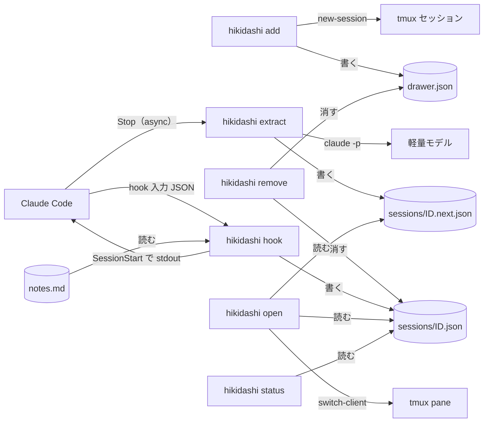
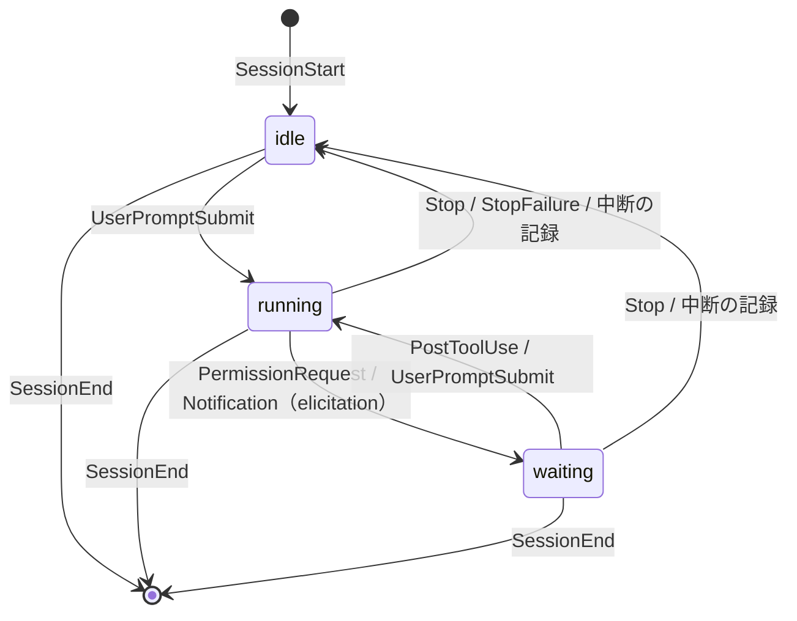

# アーキテクチャ

hikidashi の設計原則と仕組みの構成。何を解くか・語彙は [`../business/concept.md`](../business/concept.md) が持つ。

## 設計原則

### 1. クライアントのリポジトリに痕跡を残さない

- 受託案件のリポジトリにある `CLAUDE.md` や `.gitignore`、`.git/` には一切手を入れない
- hooks は Claude Code plugin としてユーザースコープで有効にする。プロジェクトの設定には何も書かない
- データはすべてリポジトリ外の `~/.hikidashi/` に置く（下記「データの置き場」）

### 2. 書き手ごとにファイルを分ける

1 ファイルの書き手は 1 種類に限る。書き手が分かれていれば、同時書き込みの競合を設計で排除できる。

| データ | 書き手 | 形式 | 理由 |
| --- | --- | --- | --- |
| 備忘録 | 人間 | Markdown | エディタでそのまま編集でき、エージェントにも読ませやすい |
| セッション状態 | hook | 1 セッション 1 ファイルの JSON | 状態の現在値。`jq` / fzf で扱いやすい |
| 次アクション | 抽出プロセス | 1 セッション 1 ファイルの JSON | hook とは書き込むタイミングが別なので、ファイルを分ける |
| 履歴・集計（将来） | hook | SQLite（`~/.hikidashi/history.db`） | 放置時間や作業履歴の集計が必要になった段階で追加 |

- JSON の書き込みは一時ファイル → rename でアトミックに行う
- SQLite を足した後も、JSON は「現在値のキャッシュ」として残せる

### 3. 状態は決定論、次アクションは抽出

- **状態** は hook のイベントと transcript の記録から決定論で判定する。LLM は使わない（下記「状態モデル」）
- **次アクション**（いま何をしていて、次に何をすべきか）は会話ログから要約して抽出する

### 4. hook は Claude Code を妨げない

- hook は失敗しても exit 0 で終わり、エラーはログにだけ残す。exit 2（ブロック）は使わない
- 状態を記録する hook は同期で動かし、数 ms で終える。時間のかかる処理（抽出）は非同期に逃がす

## 構成要素



| 要素 | 実体 | 役割 |
| --- | --- | --- |
| `hikidashi` | Go の単一バイナリ | 以下のサブコマンドをすべて持つ。`PATH` 上に置く |
| `hikidashi add` | 人間が起動 | 作業ディレクトリの案件を引き出しとして登録し、tmux セッションを用意する |
| `hikidashi remove` | 人間が起動 | 案件の登録を取り消す。空でない備忘録は残す |
| `hikidashi hook` | hook から起動 | 登録済みの引き出しへの状態の記録、備忘録の注入 |
| `hikidashi extract` | `Stop` の async hook から起動 | transcript の末尾から次アクションを抽出する |
| `hikidashi open` | tmux の `display-popup` から起動 | fzf で一覧を出し、選んだ pane へ移動する |
| `hikidashi status` | tmux の `status-right` から起動 | 入力待ちの件数を出す |
| `hikidashi notes` | 人間が起動 | 現在の引き出しの `notes.md` を `$EDITOR` で開く |
| plugin | `plugin/hooks/hooks.json` | 各イベントを `hikidashi` に繋ぐだけ。ロジックは持たない |

- 言語は Go とする。hook はツール呼び出しのたびに起動するため起動の速さが効き、単一バイナリで依存なく配れる
- plugin はリポジトリ直下の marketplace（`.claude-plugin/marketplace.json`）から `hikidashi@hikidashi` として配る
- plugin にはバイナリを同梱しない。プラットフォームごとのバイナリを plugin に積むと配布が重くなるため、`PATH` 上の `hikidashi` を呼ぶ
- 外部コマンドへの依存は `git`・`tmux`・`fzf`・`claude` に限る
- 対象 OS は Linux とする。読み手の生存確認が `/proc` に頼るため、他の OS では `open`・`status` がエラーで終わる

## 状態モデル

| 状態 | 識別子 | 意味 |
| --- | --- | --- |
| 走行中 | `running` | Claude がターンを処理している |
| 入力待ち | `waiting` | ターンの途中で人間の判断（権限の承認・入力フォーム）を待っている |
| アイドル | `idle` | ターンが終わり、人間の次の指示を待っている |

終了したセッションは状態を持たず、ファイルごと消える（下記「セッションの後始末」）。



| イベント | matcher | 状態 | その他の処理 |
| --- | --- | --- | --- |
| `SessionStart` | `startup` `resume` `clear` `fork` | `idle` | 備忘録を注入する |
| `SessionStart` | `compact` | 変えない | 備忘録を注入する（圧縮で失われるため） |
| `UserPromptSubmit` | — | `running` | |
| `PermissionRequest` | — | `waiting` | |
| `Notification` | `elicitation_dialog` `elicitation_url_dialog` | `waiting` | |
| `PostToolUse` | — | `running` | 権限の承認後に走行へ戻ったことを拾う |
| `Stop` / `StopFailure` | — | `idle` | `Stop` では async で `hikidashi extract` を起動する |
| `SessionEnd` | — | — | セッションのファイルを消す |

- `PermissionRequest` で `waiting` にする理由: 権限プロンプトの直前に発火する。`Notification` の `permission_prompt` は表示から約 6 秒遅れて届くため使わない
- `PostToolUse` が必要な理由: 権限を承認しても `UserPromptSubmit` は発火しない。承認後に最初に発火するのはツール実行後の `PostToolUse` である
- 状態が変わらないイベントではファイルを書かない。`PostToolUse` は頻繁に発火するため、読むだけで終える
- `PostToolUse` は `waiting` のときだけ `running` にする（状態図どおり）。ファイルが無い・`idle` のセッションは走行中にしない
- `SessionStart`（`compact` 以外）は、ファイルがあっても `idle` で書き直し、`started_at` を今にする
- 他のイベントでファイルが無ければ（hikidashi の導入前から続くセッション等）、`started_at` を今にして作る
- 表の matcher の絞り込みは hikidashi が入力の `hook_event_name`・`source`・`notification_type` で行い、plugin の matcher に頼らない。何もしない入力（表に無い通知種別・未知のイベント）は git を起動する前に終える
- `session_id` はファイル名に使うため `[A-Za-z0-9_-]+` に限る。それ以外はパス横断を防ぐため入力の誤りとし、ログに残して終える

### 中断の扱い

ユーザーが Esc で中断すると、`Stop` も `Notification`（`idle_prompt` を含む）も発火せず、状態を変える hook が無い。
一方 transcript には、中断の記録として `[Request interrupted by user]`（ツール実行中は `[Request interrupted by user for tool use]`）で始まる `user` のエントリが残る。

- 読み手（`open` / `status`）は、`running` / `waiting` のセッションについて transcript の末尾を読み、最後の `user` のエントリが中断の記録で、その時刻が `state_changed_at` より後なら `idle` として扱う
- セッションのファイルは書き換えない（書き手は hook だけ）。次の `UserPromptSubmit` で hook が正しい状態に戻す

## データの置き場

```
~/.hikidashi/
├── hikidashi.log                      # hook・extract のエラーログ
└── drawers/<slug>/
    ├── drawer.json                    # 引き出しのメタ情報
    ├── notes.md                       # 備忘録（人間が書く）
    └── sessions/
        ├── <session_id>.json          # セッション状態（hook が書く）
        ├── <session_id>.next.json     # 次アクション（extract が書く）
        └── <session_id>.extract.lock  # 抽出の排他・間引き用
```

- ディレクトリは 0700、ファイルは 0600 で作る。案件の情報を他のユーザーから読めなくするため
- リポジトリ内（`<repo>/.hikidashi/` を `.git/info/exclude` で除外）は採らない。`.git` も案件リポジトリの一部であり、原則 1 に反するため
- 備忘録がリポジトリの横に無い分は、`hikidashi notes` で補う
- リポジトリを移動すると別の引き出しになる。頻度が低いため、移行の仕組みは持たない

### スキーマ

`drawer.json`

| フィールド | 内容 |
| --- | --- |
| `path` | リポジトリのルートの絶対パス（シンボリックリンク解決済み） |
| `name` | リポジトリ名（`path` の basename）。一覧での表示名 |
| `created_at` | 登録時刻（RFC 3339） |

`sessions/<session_id>.json`

| フィールド | 内容 |
| --- | --- |
| `session_id` | Claude Code のセッション ID |
| `cwd` | 直近の hook 入力の作業ディレクトリ |
| `tmux_pane` | `$TMUX_PANE`（例: `%12`） |
| `claude_pid` | `$CLAUDE_PID`（Claude Code 本体の PID）。生存確認に使う |
| `transcript_path` | 会話ログの JSONL のパス |
| `state` | `running` / `waiting` / `idle` |
| `state_changed_at` | 現在の状態に入った時刻。放置時間の表示に使う |
| `started_at` | セッションの開始時刻 |

`sessions/<session_id>.next.json`

| フィールド | 内容 |
| --- | --- |
| `summary` | いま何をしているか（1〜2 文） |
| `human_next` | 人間の次アクション。無ければ空 |
| `claude_next` | Claude の次アクション。無ければ空 |
| `blockers` | ブロッカーの配列（要素は文字列） |
| `generated_at` | 抽出した時刻 |

## 引き出しの解決と登録

hook・extract・`hikidashi notes`・`hikidashi add`・引数なしの `hikidashi remove` は `cwd`（hook の入力、または作業ディレクトリ）から引き出しを決める。

1. `git -C <cwd> rev-parse --path-format=absolute --git-common-dir --show-toplevel` を 1 回呼ぶ。共通の `.git` の basename が `.git` ならその親を、それ以外（submodule 等）は toplevel をリポジトリのルートとし、シンボリックリンクを解決する。worktree からでもメイン worktree に寄り、submodule はそれ自身の引き出しになる
2. git が非 0 で終わる `cwd`（Git 管理外・bare・`.git` の中・存在しない）は追跡しない（1 案件 = 1 リポジトリ）。備忘録の注入も行わない。git を起動できないときだけエラーにする
3. `<slug>` は `<name>-<ルートの絶対パスの SHA-256 の先頭 8 桁>` とする（例: `api-3f2a9c1b`）
4. `drawers/<slug>/drawer.json` があれば登録済みとし（`hikidashi add` が書き、`hikidashi remove` が消す）、それだけを記録・注入・抽出・`hikidashi notes` の対象にする。無ければ（未登録）何も作らず何もしない。壊れていればエラーにする

- slug をハッシュにする理由: パスを `-` で繋ぐ方式は `a-b/c` と `a/b-c` が衝突し、衝突の検出と回避を別途書くことになる。ハッシュなら固定長で衝突を考えなくてよく、読みやすさは `name` の接頭辞で保つ
- 未登録はエラーではない。hook・extract は `hikidashi.log` にも何も書かずに exit 0 で終える。人が登録していないリポジトリで Claude Code が動くのは普通のことであり、そのたびに記録やログを残さないため
- 引き出しの一覧は `drawers/` 配下の列挙で得る。別途の一覧ファイルは持たない
- submodule を親の引き出しに寄せない理由: 独立したリポジトリであり、語彙どおり別の案件として扱う。submodule の worktree も別の引き出しになる
- `$TMUX_PANE` が空（tmux 外）のセッションは状態を記録しない。一覧から選んでも移動先が無いため。備忘録の注入は行う

### `hikidashi add`

1. 作業ディレクトリの引き出しを上記の規則で解決し、未登録なら `drawer.json` を書いて登録する。Git 管理外なら何も作らない
2. 引き出しの tmux セッションが無ければ（`tmux has-session -t =<name>` の exit 1）、`tmux new-session -d -s <name> -c <リポジトリのルート>` で作る。サーバーが未起動でも exit 1 になり、`new-session` がサーバーを起動する
3. 引き出しとセッションの結果を 1 行ずつ stdout に出す: `drawer: <slug> (registered|already registered)`、`tmux session: <name> (created|already exists)`

- 足りない方だけを作るため、何度実行してもよい。既存の `drawer.json`（`created_at`）とセッションには触れない
- 引数があれば exit 2。Git 管理外・git や tmux の失敗は、理由を stderr に出して exit 1 とする
- tmux のセッション名は slug の `.` と `:` を `_` に置き換えたもの（例: `example_com-3f2a9c1b`）。tmux がこの 2 文字をターゲットの区切りに使うため
- セッション名を slug から作る理由: 引き出しと 1 対 1 で決まり、同名で別パスのリポジトリでも衝突しない。対応を保存する欄も要らない
- `has-session` のターゲットに `=` を付けるのは、tmux が付けないと前方一致で別のセッションにも一致させるため

### `hikidashi remove`

1. 対象の引き出しを決める。引数が無ければ作業ディレクトリから上記の規則で、1 個あれば登録済みの引き出しから名前で引く
2. `drawer.json` を先に消して登録を外す（以後 hook・extract・`open`・`status` の対象外になる）。次に `notes.md` 以外（`sessions/`）を消す。`notes.md` が無い・空白だけなら引き出しのディレクトリごと消す
3. `drawer: <slug> (removed)` を stdout に出し、備忘録を残したときだけ `notes: <notes.md の絶対パス> (kept)` を続ける

- 名前は slug の完全一致を優先し、無ければ `name` が一意に一致する引き出しとする。`name` が複数に一致すれば候補の slug を出してエラーにする。この解決は `open` のプレビューと共有する
- 空でない備忘録を残すのは、確認なしに人の書いたものを失わないため。`drawer.json` が無いので記録・一覧・注入の対象にならず、同じパスの `hikidashi add` で slug が同じ引き出しに戻る
- tmux セッションには触れない。pane で動く Claude Code やエディタの作業を巻き込むため。閉じるのは人が行う
- 引数が 2 個以上なら exit 2。Git 管理外・未登録・曖昧な名前・I/O の失敗は、理由を stderr に出して exit 1 とする。未登録なら `hikidashi add` で登録できることも出す。見つからないときはデータルートにも tmux にも触れない

## 備忘録

### 注入

- `SessionStart` のすべての `source` で、`notes.md` を JSON の `hookSpecificOutput.additionalContext` に入れて stdout に 1 回で出す。tmux 外のセッションにも出す
- `additionalContext` は見出し `# hikidashi notes for <name> (<notes.md の絶対パス>)`、空行、`notes.md` の本文の順に並べる
- 素の Markdown で出さない理由: 本文が `{`〜`}` だと JSON と解釈され、注入の成否が内容次第になる
- `notes.md` が無い・空白だけなら何も出さない。注入と状態の記録は独立させ、片方が失敗してももう片方を行う
- Claude Code は 10,000 字を超える `additionalContext` をファイルに退避し、そのパスと先頭 2,000 字のプレビュー（見出しを含む）だけを渡す。Claude は退避先を読むよう促されないため、常に見せたいことは先頭に書く。hikidashi は切り詰めない

### `hikidashi notes`

- 作業ディレクトリの登録済みの引き出しに、`notes.md` が無ければ空（0600）で作ってから `$EDITOR` で開く。既存の中身は変えない
- `$EDITOR` は空白で分割し、シェルを介さずに起動する。引用符付きの値には対応しない
- 引数があれば exit 2。Git 管理外・未登録・`$EDITOR` が空・エディタの失敗は exit 1 とする。Git 管理外・未登録では「登録済みの引き出しの中にいない」ことと、`hikidashi add` で登録できることを stderr に出す。Git 管理外・未登録・`$EDITOR` が空ではデータルートに何も作らない

## 次アクションの抽出

1. `Stop` の async hook が `hikidashi extract` を起動する（hook の完了は待たれない）。`HIKIDASHI_DISABLE=1`・`$TMUX_PANE` が空・Git 管理外・未登録なら、stdin を読んだ後に何もせず終える
2. `<session_id>.extract.lock` の中身を「再実行要求」の印とし、印を立ててから flock（待たない）を試みる。取れなければそのまま終わる。保持者は「印を消して抽出」を印が無くなるまで繰り返し、解放後に印が残っていれば取り直す（解放の直前に届いた要求を取りこぼさない）。連続したイベントは後ろ寄せで 1 回にまとまり、同じセッションの抽出は並行しない
3. transcript の JSONL から末尾の `user` / `assistant` のテキストをバイト上限まで集める。ツールの入出力は落とす
4. `claude -p --model haiku --output-format json --json-schema <スキーマ> --no-session-persistence --tools "" --system-prompt <プロンプト>` に会話を stdin で渡す。作業ディレクトリはデータルート、環境変数に `HIKIDASHI_DISABLE=1` を足し、120 秒で打ち切る
5. 結果の `is_error` が偽・`subtype` が `success`・`structured_output` に 4 フィールドが揃っていれば、セッション状態のファイルがあることを確かめてから `<session_id>.next.json` をアトミックに書く。失敗したら前回の結果に触れない

- extract も hook と同じく常に exit 0 で終え、失敗は `hikidashi.log` に `extract:` の行で残す
- 再帰の防止: 子の `claude -p` でもユーザーの plugin の hooks は発火し、`$TMUX_PANE` も引き継がれる。放置すると抽出のたびに偽のセッションが記録されるため、子には `HIKIDASHI_DISABLE=1` を渡し、`hikidashi hook` と `hikidashi extract` はこれを見たら何もせずに終える。hooks を飛ばす `--bare` は OAuth 認証で使えないため採らない
- 子をデータルートで動かすのは、案件のリポジトリの `CLAUDE.md` や設定を読ませないため。`--tools ""` により子はツールを使えず、transcript に書かれた指示に従ってもファイルやコマンドに触れない
- `--no-session-persistence` により、抽出の実行は transcript を残さない。構造化出力は結果の JSON の `structured_output` に入る
- セッション状態のファイルを確かめるのは、抽出の間に `SessionEnd` が来たセッションに、読み手のいない次アクションを残さないため
- 要約用のプロンプトとスキーマはバイナリに埋め込む

## セッションの後始末

- `SessionEnd` で `<session_id>.*` を消す。`--resume` で戻れば `SessionStart` で作り直される
- `SessionEnd` は `/exit` や pane の kill（SIGHUP）では発火するが、SIGKILL やクラッシュでは発火しない
- 取り残されたファイルは、読み手（`open` / `status`）が `claude_pid` のプロセスが生きていて名前（`/proc/<pid>/comm`）が `claude` であることを確かめ、そうでなければ消す
- pane の存在では生死を判定しない。claude が死んでも pane はシェルに戻って残るため
- 読み手が消すのは原則 2 の例外だが、消すのは書き手が二度と書かないファイルに限るため競合しない

## UI

- `hikidashi open` は fzf の一覧を出す。1 セッション 1 行で、引き出し名 → 状態 → 放置時間 → 次アクションの列順に並べる。「引き出し → セッション」はこの列順のことで、一覧を引き出しごとにはまとめない
- 並び順は `waiting` → `idle` → `running`。人間が捌くべきものを上に出す。同順位は放置の長い順、次に引き出し名の順とする
- 状態と放置時間は中断を反映した実効の値で出す。放置時間はその状態に入ってからの経過で、`5m` / `3h` / `2d` の形に切り捨てる
- 次アクションの列は `human_next`、空なら `summary` を出す。未抽出なら `-` を出し、一覧からは外さない
- fzf のプレビューに次アクションの全文と備忘録を出す。各行の先頭に fzf には見せない隠しキー `<slug>/<session_id>` を持たせ、プレビューは `hikidashi open --preview {1}` でそれを受け取る
- 隠しキーからパスは組み立てない。slug は登録済みの引き出しのディレクトリ名と照合し、`session_id` はファイル名に使える形に限る。データルートの外を読ませないため
- Enter で `tmux switch-client -t <pane>` し、該当 pane に移動する
- `hikidashi status` は `waiting` の件数だけを出す。0 件なら何も出さない。出力は件数と改行のみで、引数があれば exit 2、失敗は `!` を出して exit 1 とする
- tmux への組み込み（キーバインドと `status-right`）はユーザーが `tmux.conf` に書く。hikidashi は `tmux.conf` を書き換えない
- 案件の tmux セッションは `hikidashi add` が用意する（上記「hikidashi add」）。移動は pane ID で行うため、ほかの tmux セッションで動く Claude Code のセッションも一覧から選べる

## 未決事項

- **SQLite を導入するタイミング**
